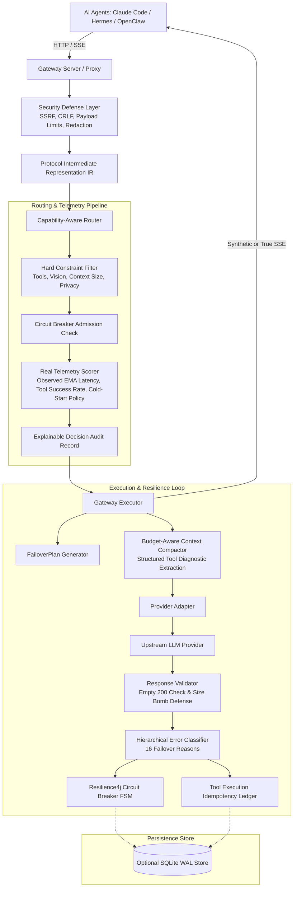
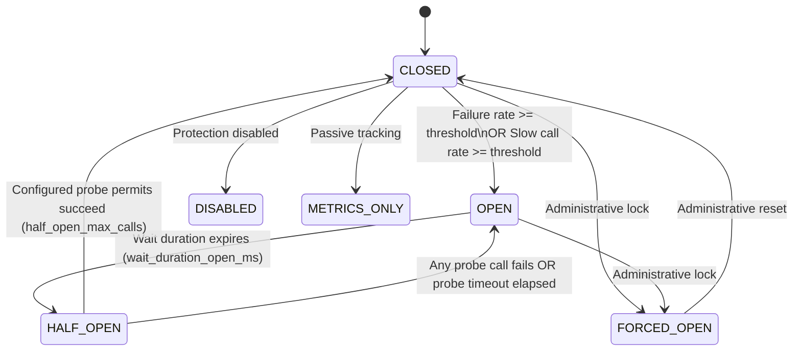
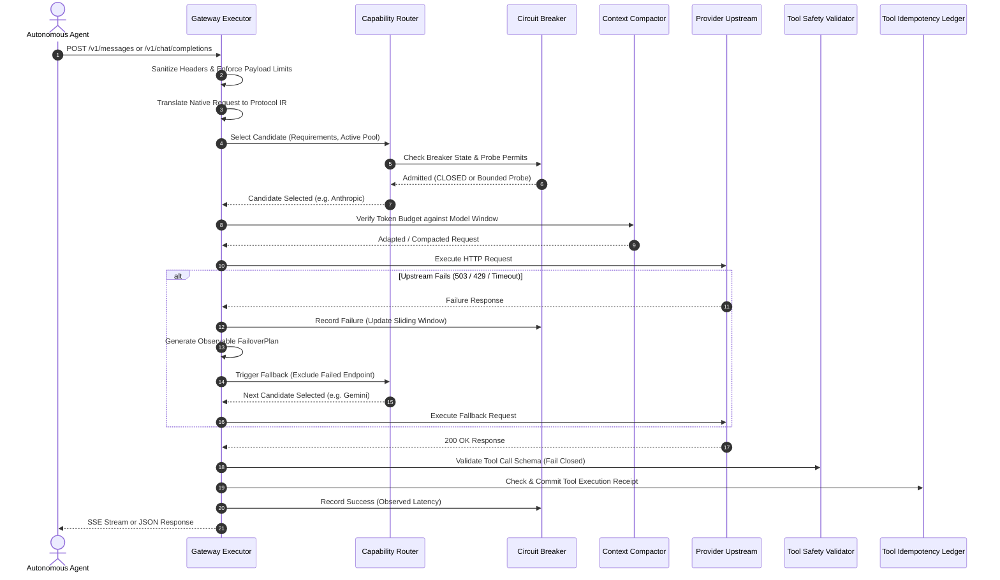

# LLM Circuit Breaker V3 — Architecture Specification

This document provides a comprehensive technical reference for the architecture, subsystems, and invariants of the LLM Circuit Breaker V3 gateway.

---

## 1. High-Level Architecture Overview

---

## 2. Finite State Machine (FSM)

The circuit breaker operates as an atomic finite state machine with 6 discrete states:

### Core Invariants:
1. **Permit-Bounded Probes**: When in `HALF_OPEN`, concurrent calls are bounded strictly to `half_open_max_calls` permits. Additional concurrent callers receive `ProbeAdmissionDeniedError` and are routed to alternative candidates.
2. **Zero Upstream Calls When OPEN**: Calls targeting an `OPEN` circuit breaker are immediately rejected with `BreakerOpenError` without placing any network load on the downstream service.
3. **Non-Poisoning Faults**: Errors classified as `SEMANTIC_AGENT_FAILURE`, `CLIENT_ERROR`, or `REQUEST_INCOMPATIBILITY` (such as 400 schema rejections or malformed tool JSON) do not increment failure metrics and cannot trip the breaker.
4. **Tool Idempotency**: Side-effecting tool calls executed before a mid-stream connection drop are recorded in the `ToolExecutionLedger`. Replays on fallback providers attach cached receipts to suppress duplicate execution.

---

## 3. Request Lifecycle Sequence

---

## 4. Subsystem Details

### A. Protocol Intermediate Representation (IR)
The gateway converts all incoming payloads into canonical `NormalizedRequest` / `NormalizedResponse` dataclasses. This eliminates $M \times N$ translator sprawl, converting provider integrations into an $O(N)$ architecture. Thinking/reasoning blocks (Claude 3.7, Gemini thinking) and multi-part content are preserved end-to-end.

### B. Observable `FailoverPlan`
When a candidate migration occurs, the gateway emits an immutable `FailoverPlan` recording source and target endpoints, token counts before and after compaction, remaining deadlines, and reason for failover.

### C. Hierarchical Context Compaction & Diagnostic Extraction
When falling back across models with different context windows (128k $\to$ 32k tokens):
1. System instructions, root user goals, and planted continuation secrets are strictly preserved.
2. The latest execution turns are preserved intact.
3. Historical tool execution logs are parsed for exit codes, error messages, and file paths; noisy multi-megabyte payloads are compressed into structured diagnostic summaries.

### D. Tool Safety & Replay Idempotency
- **Rule 1 (Fail Closed):** If a model generates missing required parameters, the call is rejected without guessing.
- **Rule 2 (Syntactic Repair Only):** Markdown fences and trailing commas are repaired; argument types and parameter names are never altered.
- **Rule 3 (Idempotent Replay):** Tool execution receipts are stored in the `ToolExecutionLedger`. Replays attach cached receipts, preventing duplicate external side-effects.

### E. Security Hardening
- SSRF prevention blocks requests to loopback (`127.0.0.1`), link-local (`169.254.169.254`), and private cloud metadata endpoints.
- CRLF injection prevention sanitizes outbound HTTP headers.
- Credential masking replaces API keys and bearer tokens with `[REDACTED]` in all structured logs.
