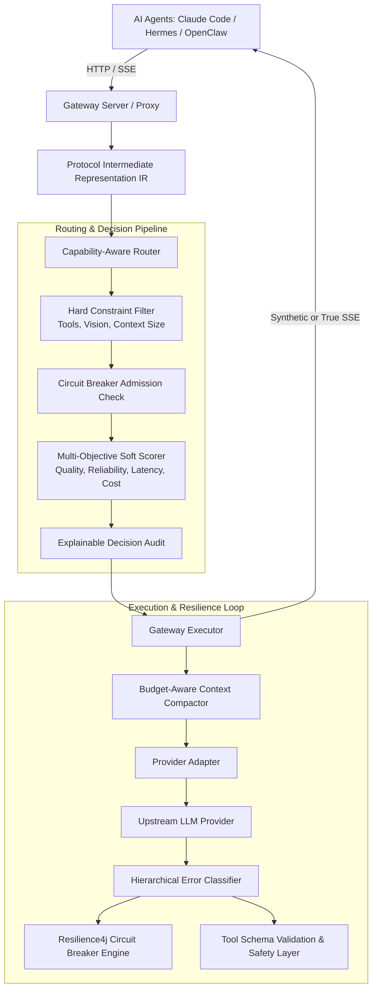
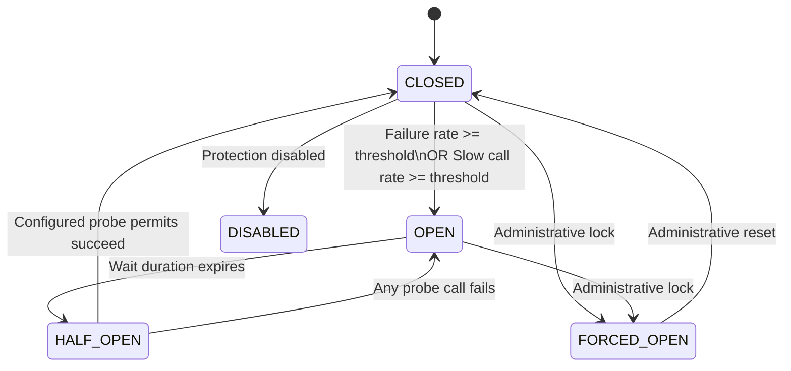
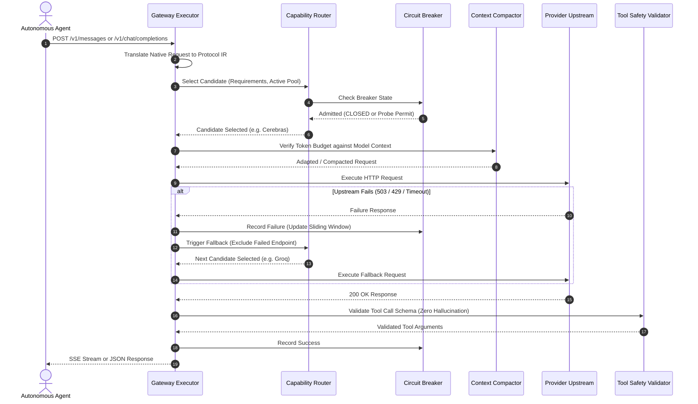

# LLM Circuit Breaker V2 — Architecture Specification

This document provides a comprehensive technical reference for the architecture, subsystems, and invariants of the LLM Circuit Breaker V2 gateway.

---

## 1. High-Level Architecture Overview

---

## 2. Finite State Machine (FSM)

The circuit breaker operates as an atomic finite state machine with 6 discrete states:

### Invariants:
1. **Permit-Bounded Probes**: When in `HALF_OPEN`, concurrent calls are bounded to `half_open_max_calls` permits. Additional concurrent calls immediately raise `ProbeAdmissionDeniedError`.
2. **Zero Upstream Calls When OPEN**: Calls targeting an `OPEN` circuit breaker are immediately rejected with `BreakerOpenError` without placing any network load on the downstream service.
3. **Non-Poisoning Faults**: Errors classified as `CLIENT_FAULT` or `REQUEST_INCOMPATIBILITY` (such as 413 context overflows or schema rejections) do not increment failure metrics and cannot trip the breaker.

---

## 3. Request Lifecycle Sequence

---

## 4. Subsystem Details

### A. Protocol Intermediate Representation (IR)
The gateway converts all incoming payloads into canonical `NormalizedRequest` / `NormalizedResponse` dataclasses. This eliminates $M \times N$ translator sprawl, converting provider integrations into an $O(N)$ architecture. Thinking/reasoning blocks (such as Claude 3.7 and Gemini thinking) are preserved end-to-end.

### B. Budget-Aware Context Compaction
When falling back from large-window models (1M tokens) to smaller-window models (32k–128k tokens), `ContextManager` applies hierarchical compaction:
1. System instructions, root user objective, and active constraints are strictly preserved.
2. The latest $K$ execution turns are preserved intact.
3. Historical tool outputs in intermediate turns are truncated to head and tail excerpts.
4. Oldest intermediate turns are evicted only if the budget remains exceeded.

### C. Tool Safety Layer (Rule 3 Compliance)
- Deterministic syntactic repairs (stripping markdown backticks, removing trailing commas) are permitted.
- Semantic guessing is strictly prohibited. If a model generates missing required parameters or hallucinates unknown tool names, the tool call is rejected as `UNSAFE_TO_REPAIR` and clean failover to another model is triggered.

### D. Multi-Agent Pool Isolation
Independent routing pools (`coding` vs `general_agent`) ensure that high-velocity coding bursts from agents like Claude Code or Aider cannot starve or trip circuit breakers for conversational agents like Hermes or OpenClaw.
