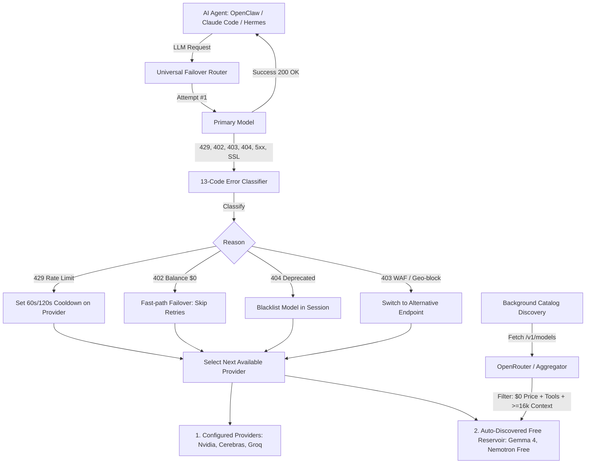

<div align="center">

# ⚡ LLM Circuit Breaker

**Zero-Downtime Multi-Provider LLM Failover & Autonomous Free-Model Discovery for AI Agents**

[](https://github.com/d2epak/llm-circuit-breaker/actions/workflows/ci.yml)
[](https://www.python.org/)
[](https://opensource.org/licenses/MIT)
[](https://github.com/psf/black)

*Never let a 429 rate limit, 402 credit exhaustion, or model deprecation crash your AI agent session.*

</div>

---

## 🚀 Why LLM Circuit Breaker?

Traditional LLM wrappers and dumb HTTP proxies break down when building real **Agentic AI systems** (Hermes, Claude Code, OpenClaw, Cursor, Aider):
- 💥 **Context Window Crashes**: Switching from a 1M token model to an 8k/32k backup causes context overflow errors.
- 💥 **Vendor Parameter Incompatibilities**: Proprietary reasoning flags (`extra_body: {"thinking": ...}`) cause `HTTP 400: Unrecognized parameter` on standard fallback models.
- 💥 **Turn Thrashing**: Naive fallbacks retry throttled keys on every single message turn, burning latency.
- 💥 **Free Tier Volatility**: Free models on aggregators appear, rename, and sunset constantly.

**LLM Circuit Breaker** solves all of these challenges with an agent-native resilience layer.



---

## ✨ Features

* 🛡️ **13-Code Error Taxonomy**: Smart classification for 429 (Rate Limits), 402 (Insufficient Credits), 403 (WAF/Cloudflare blocks), 404/400 (Deprecations), 5xx (Outages), and TLS handshake failures.
* ⏱️ **Zero-Thrash Cooldown Memory**: Remembers rate-limit backoff timers (60s $\rightarrow$ 120s $\rightarrow$ 240s) so subsequent turns skip throttled providers instantly.
* 🔍 **Autonomous Free-Model Discovery**: Automatically queries live aggregator catalogs, filters for **100% Free (\$0)** + **native tool-calling support** + **$\ge$16k context window**, and tracks sunsetted models.
* 🧹 **Parameter Sanitization**: Automatically scrubs vendor-specific reasoning tags (`thinking`) to prevent HTTP 400 errors during failover.
* 🔌 **Universal Drop-in Proxy**: Run as a local proxy (`http://127.0.0.1:8000/v1`) for instant zero-code-change integration with **Claude Code**, **Cursor**, or **Aider**.

---

## 📦 Installation

```bash
# Basic Python Library
pip install llm-circuit-breaker

# With Local Proxy Support (FastAPI + Uvicorn)
pip install "llm-circuit-breaker[proxy]"
```

---

## 🛠️ Quickstart

### 1. Direct Python Integration (OpenClaw, Custom Agents)

```python
from llm_circuit_breaker import UniversalFailoverRouter, classify_api_error, FailoverReason
import openai
import os

# Initialize router with priority keys + auto-discovered free backups
router = UniversalFailoverRouter(configured_fallbacks=[
    {"provider": "nvidia", "model": "nvidia/nemotron-3-ultra-550b-a55b", "base_url": "https://integrate.api.nvidia.com/v1", "key_env": "NVIDIA_API_KEY"},
    {"provider": "cerebras", "model": "llama3.3-70b", "base_url": "https://api.cerebras.ai/v1", "key_env": "CEREBRAS_API_KEY"},
    {"provider": "groq", "model": "llama-3.3-70b-versatile", "base_url": "https://api.groq.com/openai/v1", "key_env": "GROQ_API_KEY"},
])

def execute_agent_step(messages: list):
    while True:
        route = router.active_provider
        api_key = os.getenv(route.get("key_env", ""), "")
        client = openai.OpenAI(api_key=api_key, base_url=route.get("base_url"))

        try:
            response = client.chat.completions.create(
                model=route["model"],
                messages=messages,
            )
            return response.choices[0].message.content

        except Exception as err:
            classified = classify_api_error(err)
            if not classified.should_fallback:
                raise err

            # Handle rate-limits & deprecations
            if classified.reason in (FailoverReason.rate_limit, FailoverReason.upstream_rate_limit):
                router.mark_cooldown(route["provider"], seconds=60.0)
            elif classified.reason == FailoverReason.model_not_found:
                router.mark_deprecated(route["model"])

            # Switch to next healthy route
            next_route = router.get_next_available_route(reason=classified.reason)
            if not next_route:
                raise RuntimeError("All LLM providers exhausted.")
```

---

### 2. Local Proxy for Claude Code / Cursor / Aider

Start the proxy:
```bash
llm-proxy --port 8000
```

Point **Claude Code** to the proxy:
```bash
export ANTHROPIC_BASE_URL="http://127.0.0.1:8000/v1"
claude
```

---

### 3. CLI Free-Model Discovery

Discover active free tool-calling models right from your terminal:
```bash
llm-discover --limit 5
```

```text
🔍 Querying provider catalog...
✅ Discovered 18 free tool-capable models (>=16k context)
📦 Tracking 0 deprecated models

Top 5 Free Models:
  1. google/gemma-4-26b-a4b-it:free (262,144 tokens context)
  2. google/gemma-4-31b-it:free (262,144 tokens context)
  3. inclusionai/ling-3.0-flash-fin:free (262,144 tokens context)
  4. dots-studio/dots-3-note-preview:free (512,000 tokens context)
  5. nvidia/nemotron-3.5-lightning:free (1,000,000 tokens context)
```

---

## 🧪 Testing

Run the comprehensive unit test suite:
```bash
pytest tests/
```

---

## 🤝 Contributing

Contributions are welcome! Please feel free to submit a Pull Request.

1. Fork the repository
2. Create your feature branch (`git checkout -b feature/AmazingFeature`)
3. Commit your changes (`git commit -m 'Add some AmazingFeature'`)
4. Push to the branch (`git push origin feature/AmazingFeature`)
5. Open a Pull Request

---

## 📄 License

Distributed under the MIT License. See `LICENSE` for more information.
