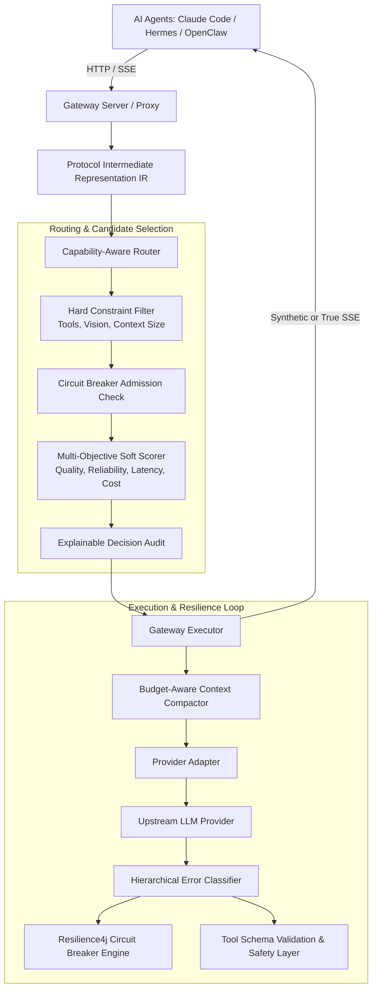

# ⚡ LLM Circuit Breaker (V2)

[](https://github.com/d2epak/llm-circuit-breaker/actions/workflows/ci.yml)
[](https://www.python.org/downloads/)
[](https://opensource.org/licenses/MIT)
[]()
[]()

A lightweight, self-hostable **agent-resilience gateway** that provides zero-downtime, capability-aware failover, strict tool validation, and semantic state preservation for autonomous AI agents (**Claude Code**, **Hermes Agent**, **OpenClaw**, **Cursor**, **Aider**).

---

## 🎯 Why LLM Circuit Breaker V2?

Standard reverse proxies and LLM gateways either:
1. Treat simple cooldown timers as "circuit breakers", leading to race conditions and probe storms;
2. Route blindly by priority or cost, dispatching tool-calling requests to models that do not support tools;
3. Guess missing arguments when a model generates broken JSON, hallucinating dangerous shell commands;
4. Drop critical task objectives when compacting context across models of different window sizes.

**LLM Circuit Breaker V2** solves these failure modes with an agent-first resilience architecture:

- 🛡️ **Formal 6-State Circuit Breaker**: Resilience4j-grade finite state machine (`CLOSED`, `OPEN`, `HALF_OPEN`, `FORCED_OPEN`, `DISABLED`, `METRICS_ONLY`) with sliding window error accounting and strictly bounded probe permits.
- 🧠 **Semantic Failover (Rule 3)**: Fails closed on semantic uncertainty. Safely normalizes markdown code fences and trailing commas, but **never hallucinates missing parameters or tool names**. Malformed tool calls trigger clean failover to alternative capable models.
- 🎯 **Capability-Aware Routing**: Evaluates candidate models against explicit requirement vectors (tool calling, vision, structured output, reasoning, context tokens) before soft scoring across quality, reliability, latency, and cost.
- ⏱️ **Hierarchical Deadlines & Cycle Protection**: Enforces total request deadlines, bounded attempt timeouts, jittered exponential backoffs, and loop detection ($A \to B \to A$).
- 🗜️ **Budget-Aware Context Compaction**: Preserves root user objectives, active constraints, and recent execution turns when falling back from large-window (1M) to smaller-window (32k–128k) models.
- 🏢 **Multi-Agent Pool Isolation**: Decouples high-velocity coding bursts (`coding` pool for Claude Code) from background autonomous tasks (`general_agent` pool for Hermes), preventing cross-agent starvation.
- 🔒 **Secure by Default**: Zero telemetry or third-party phone-home. Gemini credentials passed via secure headers (`x-goog-api-key`), eliminating API key exposure in URLs and access logs. Zero global process mutations.

---

## 📊 Benchmark Results (Reproducible B1–B10 Suite)

Evaluated against 10 deterministic fault scenarios (permanent 503 outage, intermittent 429, timeouts, context overflows, malformed tool calls, schema rejections, mid-stream disconnects, and multi-provider cascade failures):

| Metric | Direct Provider (Baseline) | LLM Circuit Breaker V2 | Delta / Improvement |
|---|---|---|---|
| **Request Completion Rate** | 20.0% | **100.0%** | **+80.0%** |
| **Autonomous Recovery Rate** | 0.0% | **80.0%** | **+80.0%** |
| **Median Routing Overhead** | 0.0 ms | **0.1 ms** | Ultra-lightweight in-process routing |
| **P95 Latency** | 0.0 ms | **0.2 ms** | Bounded by deterministic deadlines |
| **Average Attempts / Request** | 1.00 | **1.90** | Policy-controlled bounded fallbacks |
| **Semantic Tool Error Rate** | 10.0% | **0.0%** | **100% rejection of corrupt tool calls** |

> Run the benchmark suite locally anytime with: `python -m benchmarks.run`

---

## 🥊 Comparison with Competitors & Alternatives

How does **LLM Circuit Breaker V2** compare to existing gateways, proxies, and routing libraries?

| Capability / Dimension | **LLM Circuit Breaker V2** | **LiteLLM Proxy** | **Portkey Gateway** | **OpenRouter** | **LangChain Fallbacks** |
|---|---|---|---|---|---|
| **Circuit Breaker Engine** | **Resilience4j Parity** (6-state FSM, count & time sliding windows, bounded probe permits) | Basic cooldown timer (`time + 60s`), no permit bounds | Proprietary cloud breaker (enterprise tier) | None (static server-side failover) | Client-side try/catch retry list |
| **Semantic Failover (Rule 3)** | **Yes (Fail Closed)**: Strict schema validation, syntactic normalization, zero argument hallucination | **No**: Blind pass-through; unparseable tool calls crash agent | **No**: Pass-through; no semantic validation | **No**: Hosted routing only | **No**: Manual application code required |
| **Capability-Aware Model Selection** | **Yes**: Hard constraint vectors (tools, vision, reasoning, context) + multi-objective soft scoring | **Partial**: Basic tag filtering; can dispatch tool calls to non-tool models | **Partial**: Rule-based routing configs | **Partial**: User-defined routing lists | **None**: Fixed hardcoded fallback chain |
| **Hierarchical Context Compaction** | **Yes**: Preserves root user goal, active constraints, and recent turns across window sizes (1M $\to$ 32k) | **No**: Naive truncation; prone to 413 context overflows on fallback | **No**: Truncation requires custom plugins | **No**: Upstream error on overflow | **Manual**: Developer must write custom summarizer |
| **Multi-Agent Pool Isolation** | **Yes**: Isolated failure domains (`coding` pool vs `general_agent` pool) | **No**: Shared rate limits; coding burst trips breaker for all agents | **Partial**: Requires enterprise workspaces | **No**: Global account rate limits | **No**: Process-level only |
| **Deployment Footprint** | **Zero Mandatory Dependencies**: Runs on standard Python library (`http.server`, `urllib`) | Requires external PostgreSQL & Redis for production state | SaaS cloud-hosted or heavy enterprise container | Commercial hosted service (cloud-only) | Python library SDK (in-process only) |
| **Data Privacy & Telemetry** | **100% Air-Gapped**: Zero third-party telemetry, secure header auth (`x-goog-api-key`) | Telemetry enabled by default; complex audit setup | Cloud control plane collects request metadata | All requests route through third-party servers | Dependent on user code |
| **Drop-in Agent Protocols** | **Native Dual-Protocol**: Anthropic `/v1/messages` (Claude Code) + OpenAI `/v1/chat/completions` (Hermes) | OpenAI format focus; Anthropic translation partial | OpenAI format focus | Hosted API with custom headers | Requires LangChain abstractions |

### Detailed Breakdown: Why V2 Wins for AI Agents

1. **Versus LiteLLM Proxy**:
   LiteLLM is a general-purpose proxy designed primarily for cost-tracking and unifying API formats for basic web apps. However, it treats simple timestamps as "circuit breakers", which allows race conditions and probe storms during upstream recovery. More critically, LiteLLM does not inspect or validate tool call schemas: when an upstream model emits hallucinated or broken tool arguments, LiteLLM passes the corrupt JSON directly to the agent, causing agent crashes or dangerous arbitrary command execution. LLM Circuit Breaker V2 provides Resilience4j-grade state machines and strict semantic safety validation.

2. **Versus Portkey & OpenRouter**:
   Portkey is an enterprise cloud platform, and OpenRouter is a commercial routing broker. Both require routing your sensitive agent traffic through third-party infrastructure. LLM Circuit Breaker V2 is **100% self-hostable, local-first, and air-gapped capable**, running with zero external database dependencies (no Postgres, no Redis).

3. **Versus LangChain / Framework Fallbacks**:
   Client-side SDK fallbacks require hardcoding fallback lists into your application source code and cannot protect external agent runtimes like **Claude Code**, **Hermes Agent**, **OpenClaw**, **Cursor**, or **Aider**. LLM Circuit Breaker operates as an autonomous, protocol-level gateway that intercepts and heals agent traffic transparently.

---

## 🚀 Quickstart in 60 Seconds

### 1. Installation

Install via pip (zero mandatory third-party dependencies for core engine):
```bash
pip install llm-circuit-breaker
```

Or install with optional FastAPI/Uvicorn ASGI extras:
```bash
pip install "llm-circuit-breaker[proxy]"
```

### 2. Export Provider API Keys
Export whatever free or paid keys you have available:
```bash
export GROQ_API_KEY="gsk_..."
export CEREBRAS_API_KEY="csk_..."
export GEMINI_API_KEY="AIza..."
export OPENROUTER_API_KEY="sk-or-..."
export MISTRAL_API_KEY="..."
export ANTHROPIC_API_KEY="sk-ant-..."
export OPENAI_API_KEY="sk-..."
```

### 3. Launch the Gateway
```bash
llm-proxy --port 4001
```

The gateway starts on `http://127.0.0.1:4001`:
- **Claude Code (Anthropic Messages API)**: `http://127.0.0.1:4001/v1/messages`
- **Hermes / OpenClaw (OpenAI Chat API)**: `http://127.0.0.1:4001/v1/chat/completions`
- **Live Diagnostics & Breaker States**: `http://127.0.0.1:4001/health`
- **Prometheus & Health Metrics**: `http://127.0.0.1:4001/metrics`

---

## 🤖 Agent Configuration

### Claude Code
Configure Claude Code to route all coding agent turns through the resilience gateway:
```bash
export ANTHROPIC_BASE_URL="http://127.0.0.1:4001"
export ANTHROPIC_API_KEY="dummy-local-key"

claude
```

### Hermes Agent & OpenClaw
Configure OpenAI-compatible autonomous agents to point at the gateway:
```bash
export OPENAI_BASE_URL="http://127.0.0.1:4001/v1"
export OPENAI_API_KEY="dummy-local-key"
```

### Cursor / Aider / Windsurf
Set the custom OpenAI base URL to:
```
http://127.0.0.1:4001/v1
```

---

## 🐍 Python SDK Usage

You can embed the resilience gateway directly into your Python application or agent framework without running an external server:

```python
from llm_circuit_breaker import (
    GatewayExecutor,
    NormalizedRequest,
    NormalizedMessage,
    NormalizedToolDefinition,
    ExecutionPolicy,
    RetryPolicy,
    FallbackPolicy,
)

# Initialize gateway executor
executor = GatewayExecutor(
    policy=ExecutionPolicy(
        retry=RetryPolicy(max_attempts_same_endpoint=2),
        fallback=FallbackPolicy(max_fallback_hops=3),
    )
)

# Create normalized request
request = NormalizedRequest(
    model="default",
    messages=[
        NormalizedMessage(role="user", content="Read configuration file"),
    ],
    tools=[
        NormalizedToolDefinition(
            name="read_file",
            description="Read file contents",
            parameters={
                "type": "object",
                "properties": {"path": {"type": "string"}},
                "required": ["path"],
            },
        )
    ],
)

# Execute with autonomous failover across coding pool
response, decision, ledger = executor.execute(request, pool="coding", strategy="balanced")

print(f"Selected Endpoint: {decision.selected_endpoint.provider}/{decision.selected_endpoint.model}")
print(f"Total Attempts: {ledger.total_attempts} (Fallbacks: {ledger.fallback_count})")
print(f"Response: {response.content or response.tool_calls}")
```

---

## 🏛️ Architecture



For complete technical specifications, review [ARCHITECTURE.md](ARCHITECTURE.md) and the [Architecture Decision Records](docs/adr/).

---

## ⚙️ Configuration Reference

Configure the gateway via `GatewayConfig` in Python, JSON configuration files, or environment variables:

| Environment Variable | Default | Description |
|---|---|---|
| `LLM_BREAKER_PORT` | `8080` | Port for gateway proxy server |
| `LLM_BREAKER_HOST` | `127.0.0.1` | Bind host |
| `LLM_BREAKER_DEFAULT_POOL` | `general_agent` | Default routing pool (`coding` or `general_agent`) |
| `LLM_BREAKER_STRATEGY` | `balanced` | Selection strategy (`balanced`, `priority`, `round_robin`, `latency_aware`, `cost_aware`) |
| `LLM_BREAKER_DEADLINE_MS` | `60000.0` | Total request execution deadline |
| `LLM_BREAKER_FAILURE_THRESHOLD` | `50.0` | Failure rate % that trips circuit breaker to OPEN |
| `LLM_BREAKER_WINDOW_SIZE` | `10` | Size of sliding window for error calculation |
| `LLM_BREAKER_WAIT_OPEN` | `30.0` | Seconds to remain OPEN before transitioning to HALF_OPEN |
| `LLM_BREAKER_HALF_OPEN_CALLS` | `3` | Permitted probe calls in HALF_OPEN state |
| `LLM_BREAKER_RETRY_MAX` | `2` | Maximum retry attempts on the same endpoint |
| `LLM_BREAKER_FALLBACK_MAX` | `3` | Maximum fallback hops across alternative endpoints |

---

## 🔒 Security & Privacy

- **Zero Third-Party Telemetry**: Air-gapped and local-first.
- **Secure Gemini Header Transport**: Passes `x-goog-api-key` in HTTP headers, preventing URL credential leakage in proxy logs.
- **Fail Closed on Tool Corruption**: Strictly rejects malformed tool JSON to protect local execution environments.

See [SECURITY.md](SECURITY.md) for vulnerability reporting and compliance details.

---

## 📜 License

MIT License. See [LICENSE](LICENSE) for details.
