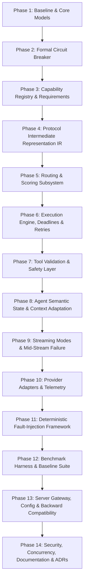

# LLM Circuit Breaker V2 — Executable Implementation Plan

**Author:** Antigravity (Principal Engineer)  
**Date:** 2026-09-03  
**Status:** Approved for Execution  
**Reference Specification:** `LLM_CIRCUIT_BREAKER_V2_LONG_HORIZON_SPEC.md`  
**Baseline Audit:** `docs/IMPLEMENTATION_BASELINE.md`

---

## 1. Plan Structure & Architectural Phasing

The implementation is structured into 14 coherent milestone phases, ordered by dependency. Foundational models, state machines, and protocols precede routing and execution, followed by agent semantics, observability, testing harnesses, benchmarks, and documentation.

---

## Phase Details

### Phase 1: Core Domain Models & Structured Failure Taxonomy
- **Objective:** Establish formal failure classification, error types, and core domain primitives, replacing ad-hoc string regexes.
- **Affected Modules:**
  - `src/llm_circuit_breaker/errors.py` [NEW]
  - `src/llm_circuit_breaker/classifier.py` [MODIFY]
  - `src/llm_circuit_breaker/models.py` [NEW]
- **Tests Required:**
  - `tests/unit/test_classifier_v2.py`: Verification of failure classes (infrastructure, rate-limit, request incompatibility, semantic/agent failure, client fault).
- **Acceptance Criteria:**
  - Hierarchical classification taxonomy is implemented.
  - Client errors and request incompatibilities are explicitly tagged as non-poisoning to provider health.
  - Backward compatibility with `classify_api_error` and `FailoverReason` is preserved.
- **Risks:** Breaking existing code expecting `FailoverReason` enum values.
- **Dependencies:** None.

---

### Phase 2: Formal Circuit Breaker State Machine
- **Objective:** Implement a Resilience4j-grade circuit breaker with sliding windows (count and time-based), failure-rate and slow-call thresholds, bounded half-open probe admission, thread safety, and monotonic clock injection.
- **Affected Modules:**
  - `src/llm_circuit_breaker/breaker/state.py` [NEW]
  - `src/llm_circuit_breaker/breaker/metrics.py` [NEW]
  - `src/llm_circuit_breaker/breaker/circuit_breaker.py` [NEW]
  - `src/llm_circuit_breaker/breaker/registry.py` [NEW]
- **Tests Required:**
  - `tests/unit/test_circuit_breaker.py`: 12 test cases specified in section 5 of V2 spec (thresholds, slow calls, probe limits, transitions, clock injection, events).
- **Acceptance Criteria:**
  - Explicit states: `CLOSED`, `OPEN`, `HALF_OPEN`, `FORCED_OPEN`, `DISABLED`.
  - Atomic, thread-safe state transitions without race conditions.
  - Monotonic clock used for all time math.
  - Half-open probe concurrency bounded strictly to configured permit count.
- **Risks:** Concurrency race conditions in sliding window updates.
- **Dependencies:** Phase 1.

---

### Phase 3: Provider & Model Capability Registry
- **Objective:** Create canonical profiles for models and providers describing context windows, output token limits, tool-calling support, parallel tools, structured output, vision, reasoning, streaming, and pricing.
- **Affected Modules:**
  - `src/llm_circuit_breaker/capability/profile.py` [NEW]
  - `src/llm_circuit_breaker/capability/registry.py` [NEW]
  - `src/llm_circuit_breaker/capability/pricing.py` [NEW]
- **Tests Required:**
  - `tests/unit/test_capability_registry.py`: Registry queries, fallback matching, incomplete metadata handling, pricing calculation.
- **Acceptance Criteria:**
  - Standard provider catalog populated (Anthropic, OpenAI, Gemini, Cerebras, Groq, Mistral, OpenRouter, NVIDIA).
  - Unknown capabilities handled conservatively.
- **Risks:** Stale model limits. Metadata must be overrideable via configuration.
- **Dependencies:** Phase 1.

---

### Phase 4: Normalized Protocol Intermediate Representation (IR)
- **Objective:** Prevent N² translation complexity by implementing a canonical request/response IR with bidirectional translators to/from Anthropic Messages, OpenAI Chat Completions, and Gemini REST protocols.
- **Affected Modules:**
  - `src/llm_circuit_breaker/protocol/ir.py` [NEW]
  - `src/llm_circuit_breaker/protocol/anthropic.py` [NEW]
  - `src/llm_circuit_breaker/protocol/openai.py` [NEW]
  - `src/llm_circuit_breaker/protocol/gemini.py` [NEW]
  - `src/llm_circuit_breaker/translators.py` [MODIFY - delegate to IR]
- **Tests Required:**
  - `tests/unit/test_protocol_ir.py`: Full round-trip translations, tool definitions, tool results, thinking/reasoning blocks, system instructions.
- **Acceptance Criteria:**
  - All Anthropic ↔ OpenAI ↔ Gemini translations route cleanly through IR.
  - Gemini schema sanitizer updated and integrated into Gemini translator.
  - Zero loss of system prompts, tool call IDs, or reasoning text.
- **Risks:** Subtleties in multipart messages or role mappings.
- **Dependencies:** Phase 3.

---

### Phase 5: Candidate Selection & Routing/Scoring Engine
- **Objective:** Implement hard-constraint filtering (tools, vision, reasoning, context size, cost ceiling) followed by soft multi-objective scoring (quality, latency, cost, reliability, tool success).
- **Affected Modules:**
  - `src/llm_circuit_breaker/routing/requirements.py` [NEW]
  - `src/llm_circuit_breaker/routing/scorer.py` [NEW]
  - `src/llm_circuit_breaker/routing/strategies.py` [NEW]
  - `src/llm_circuit_breaker/routing/decision.py` [NEW]
- **Tests Required:**
  - `tests/unit/test_routing_engine.py`: Hard constraints disqualifying cheaper candidates, soft scoring weights, explainable decision records, strategy implementations (priority, round-robin, latency-aware, cost-aware, balanced).
- **Acceptance Criteria:**
  - Hard constraints cannot be overridden by soft scores.
  - Every decision produces a structured `RoutingDecision` explanation record.
- **Risks:** Flapping routes if telemetry is noisy.
- **Dependencies:** Phase 2, Phase 3.

---

### Phase 6: Execution Engine, Deadlines & Policy Engine
- **Objective:** Implement deadline-aware request execution, bounded retries with jittered exponential backoff, circuit-breaker-aware fallback policies, cycle detection, and attempt ledgers.
- **Affected Modules:**
  - `src/llm_circuit_breaker/execution/deadline.py` [NEW]
  - `src/llm_circuit_breaker/execution/policy.py` [NEW]
  - `src/llm_circuit_breaker/execution/executor.py` [NEW]
  - `src/llm_circuit_breaker/execution/ledger.py` [NEW]
- **Tests Required:**
  - `tests/unit/test_execution_policy.py`: Retry policies, backoff calculation, Retry-After honoring, deadline exhaustion aborting fallback, cycle prevention.
- **Acceptance Criteria:**
  - No unbounded retry loops.
  - Total operation deadline prevents slow cascaded fallbacks.
  - Cycle detection stops ping-pong retries between same providers.
- **Risks:** Premature timeout if attempt deadlines are configured too tightly.
- **Dependencies:** Phase 2, Phase 5.

---

### Phase 7: Tool Validation & Safety Layer
- **Objective:** Validate tool invocations against tool schema before commitment. Implement deterministic syntactic normalization while strictly prohibiting semantic guessing or argument hallucination.
- **Affected Modules:**
  - `src/llm_circuit_breaker/agent/tool_validation.py` [NEW]
- **Tests Required:**
  - `tests/unit/test_tool_validation.py`: Syntactic JSON repair (fences, trailing commas), rejection of missing required fields, rejection of invented tool names, classification into `valid`, `normalized`, `invalid`, `unsafe_to_repair`.
- **Acceptance Criteria:**
  - Zero hallucinated tool arguments.
  - Strict mode fails closed on ambiguous repairs.
- **Risks:** Overly strict schema checks rejecting valid permissive schemas.
- **Dependencies:** Phase 4.

---

### Phase 8: Agent Semantic State & Context Adaptation
- **Objective:** Provide a provider-neutral `AgentState` and `StateSnapshot` representation, coupled with a budget-aware context manager that compacts history hierarchically without losing essential task goals.
- **Affected Modules:**
  - `src/llm_circuit_breaker/agent/state.py` [NEW]
  - `src/llm_circuit_breaker/agent/snapshots.py` [NEW]
  - `src/llm_circuit_breaker/agent/context.py` [NEW]
  - `src/llm_circuit_breaker/pruner.py` [MODIFY - delegate to context manager]
- **Tests Required:**
  - `tests/unit/test_agent_state.py`: Serialization/deserialization of agent state, invariant preservation.
  - `tests/unit/test_context_manager.py`: Token budget math, output reservations, compaction preserving goal and active tools, context-overflow recovery path.
- **Acceptance Criteria:**
  - Critical goal and constraints are never dropped during compaction.
  - Context compaction correctly targets candidate context window minus safety margins.
- **Risks:** Token estimation discrepancies across diverse model families.
- **Dependencies:** Phase 4, Phase 7.

---

### Phase 9: Streaming Architecture & Mid-Stream Semantics
- **Objective:** Support both Mode A (True streaming passthrough) and Mode B (Synthetic / buffered streaming for atomic validation and failover replay). Establish explicit mid-stream failure recovery policies.
- **Affected Modules:**
  - `src/llm_circuit_breaker/streaming/modes.py` [NEW]
  - `src/llm_circuit_breaker/streaming/buffer.py` [NEW]
  - `src/llm_circuit_breaker/streaming/events.py` [NEW]
- **Tests Required:**
  - `tests/unit/test_streaming.py`: True stream event forwarding, synthetic stream event generation, mid-stream disconnect handling, failure policy execution.
- **Acceptance Criteria:**
  - Mode A passes raw SSE chunks with minimal latency.
  - Mode B buffers completely and validates before emitting SSE.
  - Mid-stream failures do not claim lossless continuation when tokens were already flushed to client.
- **Risks:** Handling network backpressure in true streaming mode.
- **Dependencies:** Phase 4, Phase 6.

---

### Phase 10: Provider Adapters & Health Telemetry
- **Objective:** Implement isolated provider adapters (Anthropic, OpenAI, Gemini, Cerebras, Groq, Mistral, OpenRouter, NVIDIA) and real-time health telemetry tracking availability, latency, TTFT, token counts, and costs.
- **Affected Modules:**
  - `src/llm_circuit_breaker/providers/base.py` [NEW]
  - `src/llm_circuit_breaker/providers/adapters.py` [NEW]
  - `src/llm_circuit_breaker/health/telemetry.py` [NEW]
  - `src/llm_circuit_breaker/health/store.py` [NEW]
- **Tests Required:**
  - `tests/unit/test_providers.py`: Request preparation, header auth (fixing Gemini URL secret vulnerability), response extraction, mock execution.
  - `tests/unit/test_health_telemetry.py`: Metric rollups, EMA latency, error tracking.
- **Acceptance Criteria:**
  - Gemini adapter uses `x-goog-api-key` header instead of query parameters.
  - No provider-specific hacks inside core routing code.
- **Risks:** Upstream provider API changes.
- **Dependencies:** Phase 3, Phase 4, Phase 6.

---

### Phase 11: Deterministic Fault-Injection Framework
- **Objective:** Build a comprehensive programmable mock provider harness simulating 429 + Retry-After, 500, 502, 503, timeouts, delayed TTFT, connection resets, mid-stream drops, context overflow, and malformed outputs.
- **Affected Modules:**
  - `tests/faults/mock_provider.py` [NEW]
  - `tests/faults/scenarios.py` [NEW]
  - `tests/faults/test_fault_injection.py` [NEW]
- **Tests Required:**
  - Complete execution of all programmable fault scenarios verifying gateway recovery.
- **Acceptance Criteria:**
  - Zero external network calls required.
  - 100% reproducible failure and recovery paths.
- **Risks:** Mock behaviors diverging from real upstream quirks.
- **Dependencies:** Phase 6, Phase 10.

---

### Phase 12: Benchmark Harness & Baseline Suite
- **Objective:** Implement reproducible benchmark runner executing scenarios B1 through B10 and comparing Direct Provider, Naive Retry, Naive Fallback, V1 Prototype, and V2 Gateway.
- **Affected Modules:**
  - `benchmarks/scenarios.py` [NEW]
  - `benchmarks/harness.py` [NEW]
  - `benchmarks/baselines.py` [NEW]
  - `benchmarks/run.py` [NEW]
  - `results/v2_benchmark_report.md` [NEW]
- **Tests Required:**
  - `tests/integration/test_benchmarks.py`: Smoke test running benchmark suite.
- **Acceptance Criteria:**
  - Scenarios B1 through B10 executed and measured.
  - Metrics collected: success rate, recovery rate, recovery latency, total latency, TTFT, P95, attempts/request, fallback depth, token overhead, estimated cost.
  - Benchmark report generated.
- **Risks:** Execution time of full benchmark suite.
- **Dependencies:** Phase 11.

---

### Phase 13: Gateway Server, Configuration & Compatibility Layer
- **Objective:** Build canonical configuration parser, backward-compatible facades for `UniversalFailoverRouter` and `IsolatedPoolManager`, and update standard library HTTP server + ASGI app.
- **Affected Modules:**
  - `src/llm_circuit_breaker/config.py` [NEW]
  - `src/llm_circuit_breaker/server/handler.py` [NEW]
  - `src/llm_circuit_breaker/server/server.py` [NEW]
  - `src/llm_circuit_breaker/router.py` [MODIFY - delegate to V2 engine]
  - `src/llm_circuit_breaker/pools.py` [MODIFY - delegate to V2 engine]
  - `src/llm_circuit_breaker/proxy.py` [MODIFY - delegate to V2 server]
  - `src/llm_circuit_breaker/__init__.py` [MODIFY - export V2 + compat]
- **Tests Required:**
  - All 14 original tests (`tests/test_*.py`) pass unchanged.
  - `tests/integration/test_server_compat.py`: End-to-end HTTP tests for `/v1/messages`, `/v1/chat/completions`, `/health`.
- **Acceptance Criteria:**
  - 100% backward compatibility with V1 API contracts.
  - Zero global socket timeout mutation.
  - One-command local demo `python -m llm_circuit_breaker.demo` working with zero keys.
- **Risks:** Inadvertent breaking change to legacy parameter signatures.
- **Dependencies:** Phase 8, Phase 9, Phase 10.

---

### Phase 14: Security Hardening, Concurrency Verification, ADRs & Documentation
- **Objective:** Perform security audit, concurrency stress testing, write 10 Architecture Decision Records (ADRs), create deep documentation guides, and perform external-style principal engineer review.
- **Affected Modules:**
  - `tests/concurrency/test_concurrency.py` [NEW]
  - `tests/security/test_security.py` [NEW]
  - `docs/ADR/0001-target-architecture.md` ... `0010-observability.md` [NEW]
  - `docs/ARCHITECTURE_V2.md` [NEW]
  - `docs/RELIABILITY_MODEL.md` [NEW]
  - `docs/FAILURE_TAXONOMY.md` [NEW]
  - `docs/ROUTING_POLICY.md` [NEW]
  - `docs/SEMANTIC_FAILOVER.md` [NEW]
  - `docs/BENCHMARKS.md` [NEW]
  - `docs/SECURITY.md` [NEW]
  - `docs/OPERATIONS.md` [NEW]
  - `docs/IMPLEMENTATION_LOG.md` [NEW]
  - `README.md` [MODIFY - rewrite for V2 reality]
  - `ARCHITECTURE.md` [MODIFY - update]
  - `pyproject.toml` [MODIFY - fix extras, update entry points]
  - `.github/workflows/ci.yml` [MODIFY - fix pip install extras]
- **Tests Required:**
  - Concurrency tests: simultaneous callers hitting one breaker, half-open probe contention, concurrent health updates.
  - Security tests: credential leak checks, SSRF validation, body size caps.
- **Acceptance Criteria:**
  - Full CI passes cleanly.
  - All claims backed by test and benchmark metrics.
  - External principal engineer review documented.
- **Risks:** None.
- **Dependencies:** All previous phases.

---

## 2. Commit Discipline & Implementation Schedule

Commits will strictly follow semantic milestone markers:
1. `v2-01-baseline`: Baseline audit and executable plan.
2. `v2-02-core-and-breaker`: Formal circuit breaker state machine, sliding windows, failure taxonomy.
3. `v2-03-capability-and-ir`: Capability registry, normalized request/response IR, bidirectional protocol translation.
4. `v2-04-routing-and-execution`: Hard constraint filtering, multi-objective scoring, deadline-aware execution, retry/fallback policies.
5. `v2-05-agent-semantics`: Strict tool validation, agent semantic state snapshots, budget-aware context adaptation.
6. `v2-06-streaming-and-providers`: True & synthetic streaming modes, isolated provider adapters, health telemetry.
7. `v2-07-fault-injection`: Programmable mock provider harness and deterministic fault scenarios.
8. `v2-08-benchmarks`: Reproducible benchmark runner, scenarios B1-B10, baseline comparisons, benchmark report.
9. `v2-09-server-and-compatibility`: Gateway server, canonical configuration, V1 backward-compatibility wrappers.
10. `v2-10-security-and-concurrency`: Concurrency verification, security hardening, regression tests.
11. `v2-11-documentation-and-adrs`: Documentation rewrite, ADRs 0001-0010, operations guide, demo module.
12. `v2-12-release-audit`: External principal engineer review and release verification.
