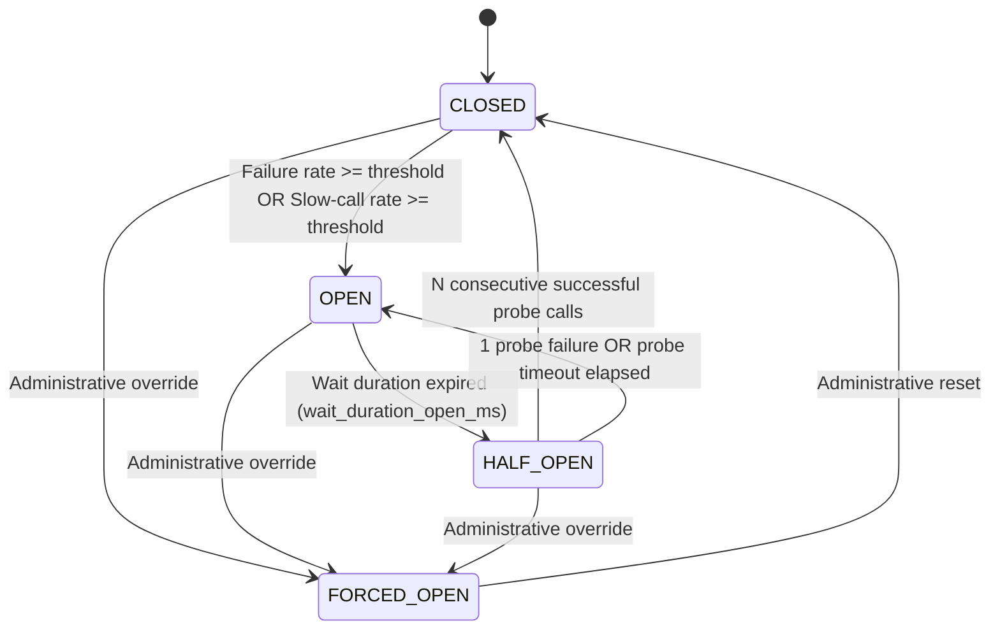

# Formal Reliability & Circuit Breaker Model

This document outlines the formal mathematical and operational model governing endpoint health, failure classification, and finite-state machine (FSM) transitions in **LLM Circuit Breaker (V3)**.

---

## 1. Mathematical FSM State Machine

### 1.1 State Definitions

1. **`CLOSED` (Normal Operation):**
   - Upstream calls are permitted without restriction.
   - Execution outcomes (latency, status codes, failure category) are recorded into a circular ring buffer of size $W$ (`sliding_window_size`).
   - If the total calls in the buffer $N \ge N_{\min}$ (`minimum_number_of_calls`), the breaker checks:
     $$\text{FailureRate} = \frac{N_{\text{failed}}}{N} \times 100 \ge \Theta_{\text{fail}}$$
     $$\text{SlowCallRate} = \frac{N_{\text{slow}}}{N} \times 100 \ge \Theta_{\text{slow}}$$
   - If either threshold is breached, the breaker atomically transitions to `OPEN`.

2. **`OPEN` (Tripped / Fast-Fail):**
   - Calls to this endpoint are immediately rejected with `BreakerOpenError`.
   - Zero upstream network calls occur.
   - The gateway router automatically excludes `OPEN` endpoints from candidate consideration.
   - The breaker remains in `OPEN` for a duration of $T_{\text{wait}}$ (`wait_duration_open_ms`).

3. **`HALF_OPEN` (Controlled Probe Admission):**
   - When $T_{\text{now}} \ge T_{\text{opened}} + T_{\text{wait}}$, the breaker enters `HALF_OPEN`.
   - Probe admission is strictly bounded by $K_{\text{probe}}$ (`half_open_max_calls`):
     - At most $K_{\text{probe}}$ simultaneous requests are permitted to execute against the upstream provider.
     - Any additional concurrent requests receive `ProbeAdmissionDeniedError` and are routed to fallback candidates.
   - **Closure Criterion:** If all $K_{\text{probe}}$ test calls succeed, the breaker transitions to `CLOSED` and the metrics ring buffer is reset.
   - **Reopen Criterion:** If any probe fails, or if probes take longer than `max_half_open_duration_ms`, the breaker immediately returns to `OPEN` and resets the wait timer.

4. **`FORCED_OPEN` (Administrative Isolation):**
   - Administratively invoked via API or CLI (`cb.force_open()`).
   - Completely isolates an endpoint from production traffic regardless of metrics or elapsed time.

---

## 2. Sliding Window Semantics

LLM Circuit Breaker supports both count-based and time-based rolling windows:

- **Count-Based Window:**
  Stores the last $W$ outcomes in a thread-safe circular array. Time complexity for recording an outcome is $O(1)$; time complexity for reading metrics is $O(1)$ via maintained cumulative counters.
- **Poisoning vs. Non-Poisoning Outcomes:**
  Failures resulting from client requests (e.g., prompt exceeds model capabilities, or invalid API key configuration) do not poison the endpoint's health window. Only true upstream faults (5xx, timeouts, connection drops) increment $N_{\text{failed}}$.

---

## 3. Real Observed Telemetry & Exploration Policy

Endpoints maintain an Exponential Moving Average (EMA) of latency and time-to-first-token (TTFT):

$$\text{EMA}_{t} = \alpha \cdot \text{Sample}_{t} + (1 - \alpha) \cdot \text{EMA}_{t-1}$$

- **Cold-Start Policy:**
  Unseen endpoints start with `is_cold_start = True` and zero artificial latency bias. To prevent cold-start starvation, the router issues explicit **Exploration Permits**, admitting low-volume traffic to newly registered endpoints until empirical telemetry is established.
