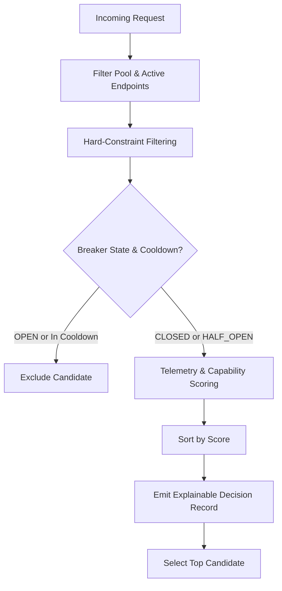

# Routing Policy, Scoring Formulas & Explainable Decisions

An authoritative specification of candidate selection, telemetry scoring, hard-constraint filtering, and decision explainability in **LLM Circuit Breaker (V3)**.

---

## 1. Candidate Selection Pipeline



### 1.1 Hard-Constraint Filters

Candidates are disqualified before scoring if they fail any of the following checks:
1. **Tool Requirement:** If the request requires tools (`require_tools = True`), models without native function calling support (`profile.supports_tools = False`) are eliminated.
2. **Context Window Minimum:** If estimated prompt tokens $T_{\text{prompt}} + T_{\text{output}} > \text{profile.context_window}$, candidate is eliminated unless context compaction is explicitly enabled.
3. **Cost Ceiling:** If prompt cost exceeds `max_cost_per_million_tokens`, candidate is excluded.
4. **Data Privacy Constraints:** If request requires on-premise or HIPAA compliance, endpoints with public retention are excluded.

---

## 2. Telemetry Scoring Formulas

Endpoints passing hard constraints are ranked according to the selected routing strategy:

### 2.1 Reliability-Aware Scoring (`strategy="reliability_aware"`)

Combines historical success rate, observed latency, and tool success rate:

$$S = w_{\text{sr}} \cdot S_{\text{sr}} + w_{\text{lat}} \cdot S_{\text{lat}} + w_{\text{tool}} \cdot S_{\text{tool}} - P_{\text{fail}}$$

Where:
- $S_{\text{sr}} = \frac{\text{successful\_calls}}{\text{total\_calls}}$
- $S_{\text{lat}} = \max\left(0, 1.0 - \frac{\text{EMA}_{\text{latency}}}{2000.0}\right)$
- $S_{\text{tool}} = \frac{\text{tool\_successes}}{\text{tool\_attempts}}$
- $P_{\text{fail}} = \min(0.5, \text{consecutive\_failures} \times 0.1)$

### 2.2 Cost-Aware Scoring (`strategy="cost_aware"`)

Ranks candidates inversely by token cost:
$$S_{\text{cost}} = \max\left(0, 1.0 - \frac{\text{Cost}_{\text{1M tokens}}}{50.0}\right)$$

### 2.3 Priority Strategy (`strategy="priority"`)

Ranks by explicit administrative priority (`Endpoint.priority`, where 1 is highest), using observed reliability as tie-breaker.

---

## 3. Explainable Decision Records

Every routing evaluation produces an audit record:
```json
{
  "selected_endpoint_id": "ep-groq-llama",
  "selection_reason": "Highest score (0.92) under reliability_aware policy",
  "evaluated_candidates": [
    {
      "endpoint_id": "ep-cerebras",
      "score": 0.0,
      "passed_hard_constraints": false,
      "exclusion_reason": "Circuit breaker is OPEN",
      "observed_latency_ms": 45.0,
      "is_cold_start": false
    },
    {
      "endpoint_id": "ep-groq-llama",
      "score": 0.92,
      "passed_hard_constraints": true,
      "exclusion_reason": null,
      "observed_latency_ms": 82.0,
      "is_cold_start": false
    }
  ]
}
```
Transparent audit records eliminate "black-box" routing behavior and allow operators to inspect why every provider selection occurred.
