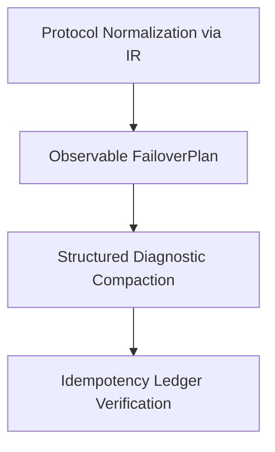

# Semantic Failover for Autonomous Agents

This document details the central innovation of **LLM Circuit Breaker (V3)**: preserving the semantic state, tool definitions, execution receipts, and task continuity required for an autonomous agent to survive provider outages and model changes.

---

## 1. Why Standard Gateways Break Autonomous Agents

When a standard gateway fails over between LLMs, it treats them as identical HTTP proxies:
1. **Tool Schema Corruption:**
   OpenAI, Anthropic, and Gemini format function definitions differently. Forwarding raw JSON leads to HTTP 400 rejection on the fallback model.
2. **Context Amnesia:**
   Failing over from a 128k context provider (e.g. Claude 3.5 Sonnet) to a 32k provider (e.g. local Llama 3) throws `context_length_exceeded`. Standard proxies truncate characters from the head of the prompt, discarding critical system instructions and mission parameters.
3. **Ghost Side-Effects (Replay Hazard):**
   If an agent's tool execution succeeded upstream, but the provider's connection dropped before the complete response finished, standard gateways blindly retry. The fallback model re-invokes the same destructive action.

---

## 2. The 4 Pillars of Semantic Failover



### Pillar 1: Canonical Protocol IR
All incoming requests (Anthropic Messages API, OpenAI Chat Completions, Google Gemini `generateContent`) are decoded into a canonical **Protocol Intermediate Representation (IR)**:
- Normalized messages with explicit roles (`system`, `user`, `assistant`, `tool`).
- Normalized tool definitions and schemas.
- Normalized multi-part content (text blocks, tool call blocks, diagnostic receipts).

When routing to an alternative candidate, the IR is dynamically re-encoded into the exact syntax expected by the target provider.

### Pillar 2: Observable `FailoverPlan`
Every model migration generates an immutable audit record:
```json
{
  "source_endpoint": "ep-anthropic-claude",
  "target_endpoint": "ep-groq-llama",
  "failover_reason": "overloaded",
  "source_context_window": 131072,
  "target_context_window": 32768,
  "context_compaction_applied": true,
  "tokens_before": 45120,
  "tokens_after": 18200,
  "tools_adapted_count": 3
}
```

### Pillar 3: Structured Diagnostic Compaction
Rather than blind substring slicing, compaction preserves:
- The system instruction and primary user mission goal.
- Continuation facts and keys.
- Structured execution diagnostics from tool history (exit codes, status keys, file paths), compressing multi-megabyte log dumps into essential semantic summaries.

### Pillar 4: Idempotent Tool Execution Ledger
Tracks every tool call by `logical_operation_id` and arguments hash. If an execution receipt exists from a previous attempt that lost connectivity, the receipt is re-attached, preventing duplicate downstream operations.
