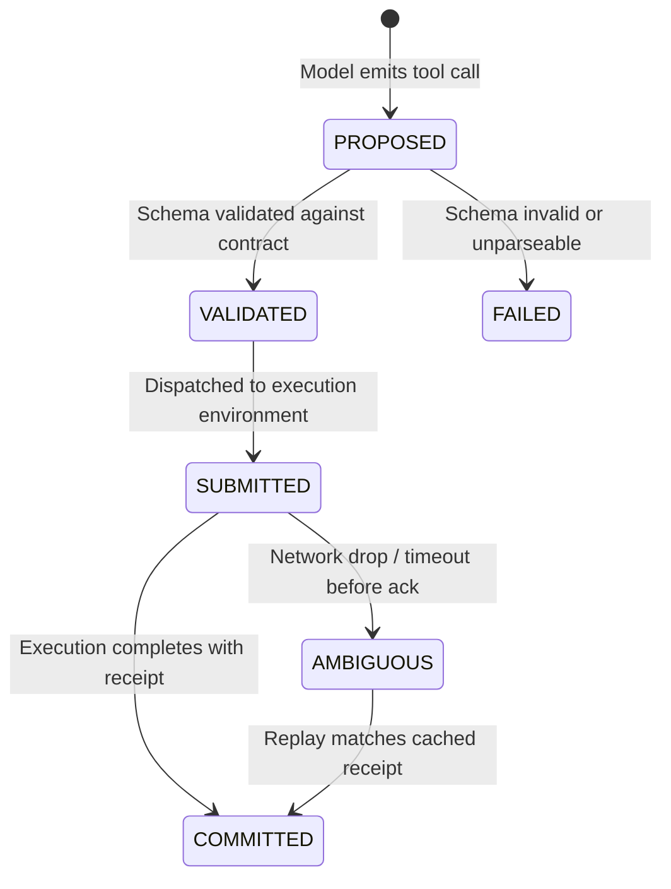

# Tool Safety, Schema Validation & Idempotency

This document specifies the safety invariants, schema validation rules, and idempotency ledger governing function execution in **LLM Circuit Breaker (V3)**.

---

## 1. The 3 Iron Rules of Tool Call Handling

1. **Rule 1: Fail Closed on Missing Required Arguments**
   If a model emits a tool call omitting a required parameter according to its schema definition, the Gateway **NEVER** guesses, invents default values, or passes partial payloads to the agent. It fails closed, categorizes the outcome as `SEMANTIC_AGENT_FAILURE`, and initiates safe failover.
2. **Rule 2: Syntactic vs Semantic Repair Boundary**
   The Gateway permits safe syntactic repair (stripping markdown backticks ` ```json `, fixing trailing commas). It **STRICTLY PROHIBITS** semantic modification (altering property types, hallucinating parameters, or modifying arguments).
3. **Rule 3: Idempotent Execution Receipts**
   Side-effecting tools executed during an agent run must not be re-executed if network connectivity drops mid-response. Cached execution receipts are re-attached to identical replayed calls.

---

## 2. Tool Execution Lifecycle State Machine



- **Receipt Storage:**
  Receipts are indexed by `_op_key(logical_operation_id, tool_name, sha256(arguments))`.
  When a retry occurs, `check_idempotency` identifies the committed operation and returns `(True, receipt)`, bypassing duplicate side effects.
